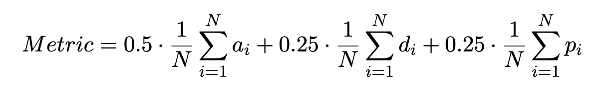
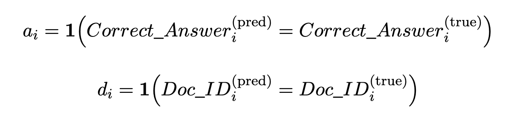
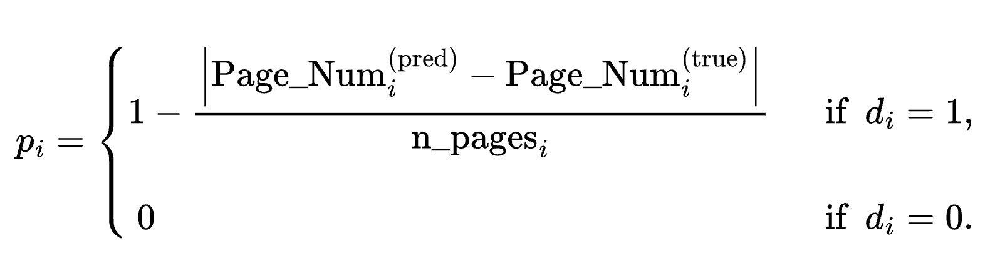

# UNLP 2026 Shared Task on Multi-Domain Document Understanding

The Fifth Ukrainian NLP Conference ([UNLP 2026](https://unlp.org.ua/)) organizes a Shared Task on Multi-Domain Document Understanding. This Shared Task aims to challenge and assess AI capabilities to find the right information in a stack of domain-specific documents and generalize across domains.

**[Registration Form](https://forms.gle/XSgyBBEB7T5Gn9gQ6)**  
**Please register by February 21, 2026.**

The Kaggle link will be sent to the registered participants on **January 15, 2026**.

Join the discussions in Discord via https://discord.gg/DYNnWaZD4a.

## Updates

**2025-12-20**:

* Add more questions for the dev set: 40 => 461 questions.
* Postpone the Kaggle release till January, 2026.

**2025-12-17**:

* Add `readme-en.txt` files describing the domains in English.

## Task Description

In this shared task, your goal is to build a solution that, given a set of documents, can (1) find the correct answer to a multiple-choice question and (2) identify the document and page where the answer was found.

The competition will run on Kaggle in the **code-only** mode, which means that you will submit your solution as code, e.g., a Python script or notebook, rather than submitting just test answers. Your solution should be able to run on a single P100 GPU and complete all test sets prediction within 9 hours. The code-only mode will facilitate fair competition. ⚖️

You are free to use any open-source embeddings and large language models of your choice — just keep in mind the compute limitations, which may not allow you to use the larger LLMs.

We encourage you to use LLMs specifically trained to work with the Ukrainian language, like [LapaLLM](https://huggingface.co/lapa-llm) and [MamayLM](https://huggingface.co/collections/INSAIT-Institute/mamaylm-v10-gemma-3).

## Data

Input data are grouped into domains. Each domain is represented by a folder of PDF documents with anonymized filenames and two readme files that describe the domain: `readme.txt` in Ukrainian and `readme-en.txt` in English.

The data is partitioned as follows:  
15% — dev  
25% — test_public  
60% — test_private

`Dev` and `test_public` have two domains, while `test_private` has three domains. The additional domain will help assess how well your solution adapts to an unknown domain.

Please see the sample `dev` files for two domains in the [data](data/) folder.

## Evaluation

The score consists of two equal parts: the correct answer to a multiple-choice question and the correct reference (the document and the page in the document).

The final score is computed as:

where:

and the page proximity score is

Please see the sample questions for the `dev` files in the [data](data/) folder:
* Your **input data** are columns `Question_ID`, `Question`, and `A-F` that represent possible answers to the question.
* Your solution should **predict** the values in `Correct_Answer`, `Doc_ID`, and `Page_Num`.
* We provide `Domain` and `N_Pages` of the correct document for `dev` to get you started. These columns will **not** be present in the test data.

Consider generating more questions on the dev set for self-assessment while we are working on the Kaggle setup.

## Publication

Participants in the shared task are invited to submit a paper to the UNLP 2026 conference. Please see the [UNLP website](https://unlp.org.ua/call-for-papers/) for details. Accepted papers will appear in the ACL anthology and will be presented at a session of UNLP 2026 specially dedicated to the Shared Task.

Submitting a paper is not mandatory for participating in the Shared Task.

## Important Dates

- **December 1, 2025** — Shared task announcement
- **December 20, 2025** — Second call for participation
- **January 14, 2026** — Third call for participation
- **January 15, 2026** — (tentatively) The Kaggle competition link is sent to the registered participants
- **February 21, 2026** — Registration deadline
- **February 22 (11:58 PM GMT +02:00), 2026** — Final submission of system responses
- **February 25, 2026** — Results of the Shared Task are announced
- **March 8, 2026** — Shared Task paper due
- **April 15, 2026** — Notification of acceptance
- **April 26, 2026** — Camera-ready Shared Task papers due
- **May 29–30, 2026** — Conference dates

## Contacts

Email: [kvrware@gmail.com](mailto:kvrware@gmail.com), [volodymyr.sydorskyi@gmail.com](mailto:volodymyr.sydorskyi@gmail.com), [mariana.scorp@gmail.com](mailto:mariana.scorp@gmail.com), [rm.natalie12@gmail.com](mailto:rm.natalie12@gmail.com)

## References

[UNLP 2026 Call for Papers](https://unlp.org.ua/call-for-papers/)

